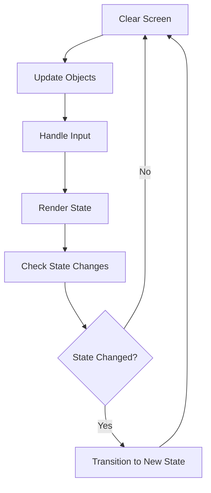
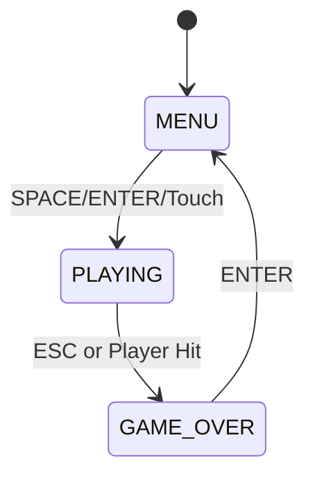

Space Birds is built on the **libGDX framework**, following a component-based architecture with clear separation between game objects and game states.

## Overview

The game is an Angry Birds-themed space shooter where the player controls a bird that shoots projectiles at falling pig enemies.

**Package structure:**
```
com.pmm.games/
├── SpaceEscape.java        # Main game class
├── GameState.java          # Game state enum
├── objects/
│   ├── Player.java         # Player character
│   ├── Bullet.java         # Player projectiles
│   └── Obstacle.java       # Enemy obstacles (pigs)
└── screens/
    └── ScoreScreen.java    # Score display screen
```

## libGDX Framework

Space Birds extends libGDX's `Game` class, which provides:

- **Application lifecycle management** - `create()`, `render()`, `dispose()`
- **Cross-platform abstraction** - Works on desktop (LWJGL3) and Android
- **Asset management** - Textures, sounds, and music
- **Graphics rendering** - SpriteBatch for 2D rendering
- **Input handling** - Keyboard, mouse, and touch events

<Info>
libGDX handles platform differences automatically, allowing the same core code to run on desktop and mobile.
</Info>

## Main Game Class

### SpaceEscape (`SpaceEscape.java:58`)

The main game class manages the entire game lifecycle.

**Key responsibilities:**
- Initializing game resources (textures, sounds, fonts)
- Managing game state transitions
- Updating game objects each frame
- Rendering the current game state
- Handling user input
- Managing collision detection

**Core methods:**

<CodeGroup>

```java create()
public void create()
```
Initialized once at startup. Loads all textures, sounds, music, and creates initial game objects.

```java render()
public void render()
```
Called every frame (~60 FPS). Updates game logic and draws everything to screen.

```java dispose()
public void dispose()
```
Called on shutdown. Releases all resources to prevent memory leaks.

</CodeGroup>

### Key Fields

| Field | Type | Description |
|-------|------|-------------|
| `batch` | `SpriteBatch` | Renders all 2D graphics |
| `player` | `Player` | The controllable bird character |
| `obstacles` | `Array<Obstacle>` | List of active pig enemies |
| `gameState` | `GameState` | Current state (MENU, PLAYING, GAME_OVER) |
| `score` | `int` | Current player score |
| `gameTime` | `float` | Elapsed time in seconds |
| `asteroidsDestroyed` | `int` | Number of pigs destroyed |

## Game Loop

The game follows a classic game loop pattern executed in `render()` (`SpaceEscape.java:174`):



**Frame execution order:**

1. **Clear screen** - Reset to background color
2. **Update objects** - `actualizarObjetos()` (`SpaceEscape.java:290`)
   - Update game timer
   - Spawn new obstacles
   - Update player and bullets
   - Update obstacles
   - Detect collisions
   - Update visual effects
3. **Handle input** - `gestionarInputs()` (`SpaceEscape.java:213`)
   - Process keyboard, mouse, touch input
   - Execute actions based on current state
4. **Render state** - `representacionEstado()` (`SpaceEscape.java:378`)
   - Draw background
   - Draw game objects
   - Draw UI text
   - Apply visual effects
5. **Process state changes** - Execute pending state transitions

## State Management

### GameState Enum (`GameState.java:13`)

The game uses a simple state machine with three states:

<CodeGroup>

```java MENU
MENU
```
Main menu screen. Shows controls and "Press SPACE to start" message. Plays Angry Birds theme music.

```java PLAYING
PLAYING
```
Active gameplay. Player can move, shoot, and avoid obstacles. Spawns enemies continuously. Plays battle music.

```java GAME_OVER
GAME_OVER
```
End screen. Shows final score and "Press ENTER to return to menu" message.

</CodeGroup>

**State transition diagram:**



### State Transitions

State changes are deferred using `nextGameState` and `gameStateChanged` flags (`SpaceEscape.java:183-205`):

1. Input handler sets `nextGameState` and `gameStateChanged = true`
2. After rendering, if `gameStateChanged` is true:
   - Execute cleanup for old state
   - Execute initialization for new state
   - Update `gameState = nextGameState`
   - Set `gameStateChanged = false`

This prevents mid-frame state changes that could cause rendering issues.

## Game Objects

### Player (`objects/Player.java:18`)

The player-controlled bird character.

**Features:**
- 4-directional movement (arrow keys or touch/drag)
- Shooting with cooldown (SPACE or right-click)
- Collision bounds smaller than visual size for fair gameplay
- Sound effects for engine and shooting
- Manages all active bullets

**Update cycle:**
1. Decrease shoot cooldown timer
2. Update all bullets
3. Remove inactive bullets

**Rendering:**
- Draws player texture at position
- Draws all active bullets

### Bullet (`objects/Bullet.java:14`)

Projectiles fired by the player.

**Properties:**
- Moves upward at constant speed (10 pixels/frame)
- Automatically deactivated when leaving screen
- Rectangle bounds for collision detection
- Active/inactive state management

**Lifecycle:**
1. Created at player position with upward velocity
2. Updates position each frame
3. Checks for screen exit or collision
4. Deactivated and removed from array when hit or off-screen

### Obstacle (`objects/Obstacle.java:16`)

Enemy pigs that fall from the top of the screen.

**Properties:**
- Moves downward at constant speed (3 pixels/frame)
- Spawned every 0.5 seconds during PLAYING state
- Random horizontal position
- Collision bounds 75% of visual size
- Can be destroyed by bullets or collide with player

**Lifecycle:**
1. Spawned at top of screen with random X position
2. Falls downward each frame
3. Removed if:
   - Exits bottom of screen
   - Hit by bullet (`destroy()` called)
   - Collides with player (triggers GAME_OVER)

## Collision Detection

The game uses **rectangle-based collision detection** via libGDX's `Rectangle.overlaps()` method.

### Bullet-Obstacle Collisions (`SpaceEscape.java:329`)

```java
for (Bullet bullet : bullets) {
    for (Obstacle obstacle : obstacles) {
        if (bullet.getBounds().overlaps(obstacle.getBounds())) {
            // Hit detected
            obstacle.destroy();
            explosionSound.play();
            asteroidsDestroyed++;
            bullet.setActive(false);
        }
    }
}
```

### Player-Obstacle Collisions (`SpaceEscape.java:418`)

```java
for (Obstacle obstacle : obstacles) {
    if (obstacle.getBounds().overlaps(player.getBounds())) {
        gameState = GameState.GAME_OVER;
        calcularPuntuacionFinal();
    }
}
```

<Warning>
Player-obstacle collision immediately triggers game over. There are no health points or lives.
</Warning>

## Rendering Pipeline

All rendering happens in `representacionEstado()` between `batch.begin()` and `batch.end()` calls:

1. **Background layer** - Static background image
2. **Effects layer** - Flash effects (white overlay on shoot)
3. **UI layer** - Score, time, instructions
4. **Game objects layer** - Player, bullets, obstacles
5. **Overlay layer** - Menu logo, game over screen

**SpriteBatch** batches all draw calls for efficient GPU rendering.

## Scoring System

Score calculation (`SpaceEscape.java:354`):

```java
score = gameTime + (asteroidsDestroyed * 10)
```

- **1 point per second** survived
- **10 points per pig** destroyed

Score is calculated when:
- Player presses ENTER during gameplay (shows score overlay)
- Game transitions to GAME_OVER state

## Resource Management

All resources are loaded in `create()` and disposed in `dispose()`:

**Textures:**
- Player, obstacles, bullets, backgrounds, logo

**Audio:**
- Music: `angry-birds.mp3` (menu), `battle.mp3` (gameplay)
- Sounds: `piuw.mp3` (shoot), `muerteCerdo.mp3` (explosion), `tension-drones.mp3` (engine)

**Fonts:**
- BitmapFont for UI text

<Tip>
libGDX requires manual disposal of resources. The `dispose()` method ensures no memory leaks occur when the game closes.
</Tip>

## Input Handling

Supports multiple input methods:

| Input Type | Controls |
|------------|----------|
| **Keyboard** | Arrow keys (movement), SPACE (shoot), ENTER (start/score), ESC (quit) |
| **Mouse** | Right-click (shoot) |
| **Touch** | Drag to move (direction from player to touch point) |

Input is polled every frame in `gestionarInputs()` and actions are executed immediately based on current `gameState`.