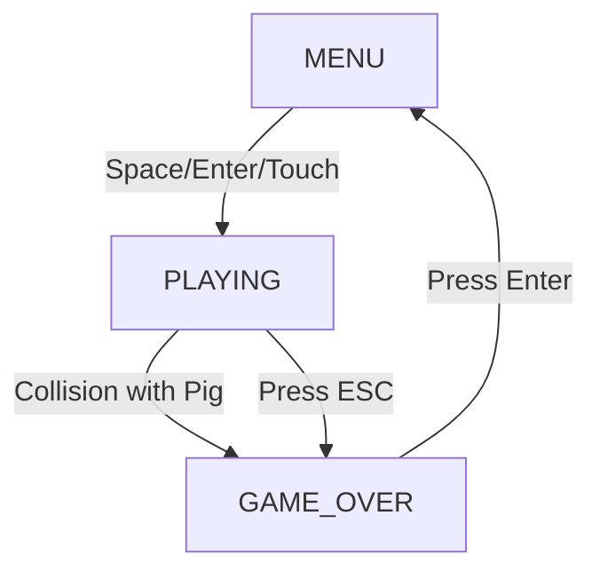

## Overview

Space Birds uses a state machine with three primary states to manage game flow. Each state has distinct visuals, controls, and behaviors.

<Card title="State Machine" icon="sitemap">
  The game uses the `GameState` enum with three states:
  - **MENU**: Starting point and main menu
  - **PLAYING**: Active gameplay
  - **GAME_OVER**: End screen with final score
</Card>

## State Diagram



<Info>
The game starts in MENU state when launched and cycles through these states until the application is closed.
</Info>

## MENU State

### Description

The initial state where players can start a new game. This is the default state when the game first launches or after returning from GAME_OVER.

### Visual Elements

| Element | Description |
|---------|-------------|
| Background | Space logo image (space.jpg) filling entire screen |
| Text Line 1 | "Pulsa ESPACIO o ENTER para comenzar" |
| Text Line 2 | "Controles: FLECHAS para mover, ESPACIO para disparar" |
| Text Line 3 | "ENTER para ver puntuación durante el juego" |
| Music | Angry Birds theme (angry-birds.mp3) looping at 50% volume |

### Available Controls

<CardGroup cols={3}>
  <Card title="SPACE Key" icon="keyboard">
    Starts the game → PLAYING
  </Card>
  
  <Card title="ENTER Key" icon="keyboard">
    Starts the game → PLAYING
  </Card>
  
  <Card title="Touch Screen" icon="hand-pointer">
    Starts the game → PLAYING
  </Card>
</CardGroup>

### State Initialization

When entering MENU state:
- Background menu music starts playing
- Game logo is displayed
- Control instructions are shown
- Player object exists but is not active

<Note>
The MENU state does not update obstacles or process gameplay logic. It's purely a waiting state.
</Note>

## PLAYING State

### Description

The active gameplay state where the player controls the bird, shoots bullets, avoids pigs, and accumulates score.

### Visual Elements

| Element | Location | Description |
|---------|----------|-------------|
| Background | Full screen | Night sky image (noche.jpg) |
| Player Bird | Bottom center | Red bird (64×64px) that moves based on input |
| Pigs | Falling from top | Enemy pigs (62×48px) spawning every 0.5s |
| Bullets | Moving upward | Red projectiles (10×20px) from player |
| Timer | Top-right | "Tiempo: Xs" showing survival time |
| Kill Count | Top-right | "Asteroides: X" showing pigs destroyed |
| Score | Top-right | "Puntos: X" showing current total |
| Status | Center-bottom | "Jugando..." in red text |
| Instructions | Top-left | ESC and ENTER key reminders |
| Flash Effect | Full screen | White flash when shooting (0.1s duration) |

### Active Systems

<CardGroup cols={2}>
  <Card title="Movement System" icon="arrows">
    Processes keyboard, touch, and mouse input for player movement within screen boundaries
  </Card>
  
  <Card title="Shooting System" icon="gun">
    Handles bullet creation with 0.3s cooldown, bullet movement, and removal when off-screen
  </Card>
  
  <Card title="Spawn System" icon="plus">
    Generates new pigs every 0.5 seconds at random horizontal positions
  </Card>
  
  <Card title="Collision System" icon="triangle-exclamation">
    Detects bullet-pig and bird-pig collisions
  </Card>
</CardGroup>

### Available Controls

| Input | Action |
|-------|--------|
| Arrow Keys | Move bird (↑↓←→) |
| SPACE | Shoot bullet |
| Right Click | Shoot bullet (alternative) |
| Touch | Move bird toward touch position |
| ENTER | Show score screen overlay |
| ESC | Quit to game over |

### State Updates

Every frame during PLAYING:

1. **Delta time** is calculated
2. **Game time** increases
3. **Spawn timer** increases (pigs spawn at 0.5s intervals)
4. **Player** updates (position, bullets, cooldown)
5. **Obstacles** update (position, removal if off-screen)
6. **Collision detection** runs for bullets and bird
7. **Flash effect** timer decreases if active

### Music

Battle music (battle.mp3) loops at 150% volume during PLAYING state.

<Tip>
The music pauses when you open the score screen with ENTER and resumes when you close it.
</Tip>

## GAME_OVER State

### Description

The end state displayed when the player dies (collision) or quits (ESC). Shows final score and allows return to menu.

### Visual Elements

| Element | Description |
|---------|-------------|
| Background | Red screen (solid red fill) |
| Title Text | "GAME OVER" in yellow (center-top) |
| Score Text | "Puntuación final: X" in yellow (center) |
| Instruction | "Pulsa ENTER para volver al menú" (center-bottom) |

### Score Calculation

When transitioning to GAME_OVER, the final score is calculated:

```java
int tiempoPuntos = (int) gameTime;           // 1 point per second
int asteroidesPuntos = asteroidsDestroyed * 10; // 10 points per kill
score = tiempoPuntos + asteroidesPuntos;
```

<Info>
The score is locked in at the moment of game over and cannot change in this state.
</Info>

### Available Controls

<Card title="ENTER Key Only" icon="keyboard">
  Pressing ENTER returns to MENU state
</Card>

<Warning>
Touch and other inputs are disabled in GAME_OVER state. Only ENTER works.
</Warning>

### State Cleanup

The GAME_OVER state does not perform cleanup. When ENTER is pressed and the game returns to MENU, the cleanup happens:

- All obstacles are cleared from memory
- Game music stops
- Menu music starts
- Score resets to 0
- Kill counter resets to 0
- Game time resets to 0
- Spawn timer resets to 0

## State Transitions

### MENU → PLAYING

**Triggers**: SPACE key, ENTER key, or Touch input

**Actions**:
1. Menu music pauses
2. Battle music starts
3. Player activates (engine sound plays)
4. Game time resets to 0
5. Spawn timer resets to 0
6. All obstacles cleared
7. State changes to PLAYING

<Note>
This transition prepares a fresh game session with clean counters and cleared obstacles.
</Note>

### PLAYING → GAME_OVER

**Triggers**: 
- Player collision with pig (automatic)
- ESC key pressed (manual quit)

**Actions**:
1. Final score calculated
2. State changes to GAME_OVER
3. Game music continues playing until ENTER pressed
4. Red screen displayed
5. Score shown

<Info>
When a collision occurs, the game immediately transitions to GAME_OVER without any "death animation" or delay.
</Info>

### GAME_OVER → MENU

**Trigger**: ENTER key

**Actions**:
1. Game music stops
2. Menu music starts
3. All obstacles cleared
4. Score resets to 0
5. Kill counter resets to 0
6. Game time resets to 0
7. Spawn timer resets to 0
8. State changes to MENU

<Tip>
This transition performs a complete game reset, so you start fresh when entering PLAYING again.
</Tip>

## State Management Implementation

### State Change Mechanism

The game uses a two-variable system:

```java
private GameState gameState;      // Current active state
private GameState nextGameState;  // Pending state for next frame
private boolean gameStateChanged; // Flag indicating transition pending
```

### Transition Process

<Steps>
  <Step title="Trigger Detected">
    When a state transition is triggered (button press, collision), the game sets:
    - `nextGameState` to the target state
    - `gameStateChanged` to `true`
  </Step>
  
  <Step title="Frame Completes">
    Current frame finishes rendering with the old state
  </Step>
  
  <Step title="State Change Processed">
    At the end of the render cycle, if `gameStateChanged` is true:
    - Cleanup/initialization code runs
    - `gameState` = `nextGameState`
    - `gameStateChanged` = `false`
  </Step>
  
  <Step title="Next Frame Begins">
    Next frame renders with the new state
  </Step>
</Steps>

<Info>
This deferred transition system prevents state changes mid-frame, which could cause rendering glitches or logic errors.
</Info>

## Special State Features

### Score Screen Overlay

While in PLAYING state, pressing ENTER shows a score screen overlay:

- Does NOT change the game state
- Pauses background music
- Shows detailed score information
- Can be dismissed to resume
- Gameplay continues in background (not paused)

<Warning>
This is not a true "pause" - pigs keep spawning and moving while the score screen is shown!
</Warning>

### Pause State

The game has a `gamePaused` boolean variable, but it's only used for the score screen overlay feature:

```java
private boolean gamePaused;
```

This does NOT implement true game pausing - it only tracks UI state.

<Note>
There is no built-in pause function that stops gameplay. Pressing ESC immediately ends the game.
</Note>

## State-Specific Music

| State | Music | Volume | Looping |
|-------|-------|--------|----------|
| MENU | angry-birds.mp3 | 50% | Yes |
| PLAYING | battle.mp3| 150% | Yes |
| GAME_OVER | (continues previous) | - | - |

<Tip>
The battle music volume is set to 150% for an intense gameplay atmosphere. The menu music is gentler at 50%.
</Tip>